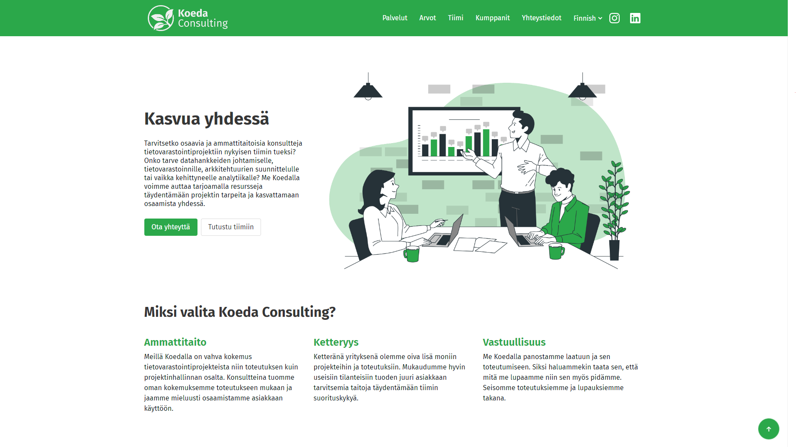

# My Coding Projects Showcase

## Project 1

Description: Koeda Consulting website redesign to be more accessible and intuitive.

## Project 2

Description: Skripti.org website.

## Project 3

Description: A website to make it easier for users to find out which student restaurant to visit for lunch, without having to visit every restaurant's homepage
## Project 4

Description: ATK-YTP event website as a member of the development team.
